# ApiAssembler

If you have a database up and running, then you can **create an API in less than 3 minutes or less.**
This library creates a boilerplate of an API Rest server based in the tables of a database. 
Unlikely other libraries, this library generates native code, so it allows any customization.

It is an alternative to Firebase, while it is less friendly, but it is also more flexible (and you can use your current data).

This library is compatible with the next databases (using the component PDO):

* MYSQL 7.0 and higher

* SQL SERVER 2008 and higher

* ORACLE 12c and higher

[](https://packagist.org/packages/eftec/ApiAssembler)
[](https://packagist.org/packages/eftec/ApiAssembler)
[]()
[]()
[]()
[]()
[]()

## Features

- [x] Model View Controller style of code.
- [x] (Optional) Custom Authentication
- [x] Repository classes to access to the database
  - [x] Create method
  - [x] Insert method
  - [x] Update method
  - [x] Delete method
  - [x] List All elements method
  - [x] List Paged elements method
  - [x] Count method
  - [x] List Raw (you can use your own SQL query) method
- [x] (Optional) Cache
- [x] CLI based

## Ideology of the architecture.

This library is not RESTFUL by design, however you can customize and use as RESTFUL.

Why? While RESTFUL could be simple, but it is also limited. This library allows to create a dozen of actions for API and those actions are not allowed in a simple RESTFUL server.  I.e. you can read information using any verb, including POST because why not?.

Verbs allowed: GET, POST, PUT and DELETE.   

Also, this library is by design static, any action is aimed to do a simple task instead of have a API methods that does many operations at the same time. That is different to GraphQL and other libraries, where the client could customize its queries.   The reason behind it is security and performance.   

Let's say we have the new path to list all the products.

> url: domain.dom/api/Product/listall (GET/POST/PUT or DELETE)

It will be separated in:

* Product = the Controller.  It is transformed into **ProductAPIController** class
* listall = the action. It is transformed into **listAllAction** method (the postfix Action is added to avoid the customer to call other functions)

It could call the next method:

```php
// note: this class controller is generated by the CLI.
class ProductAPIController {
    // ...
    public function listAllAction($id=null,$idparent=null,$event=null) {
        // the code goes here
    }
    // ...
}
```

But what if we want to call it only for a specific verb (POST)

```php
class ProductAPIController {
    // ...
    public function listAllActionPOST($id=null,$idparent=null,$event=null) {
        // Check how the method ends with POST.
    }
    // ...
}
```

Now, let's say we want to list products of a "category" and only for GET

>  url: domain.dom/api/Product/listByCategory/200 (GET)

```php
class ProductAPIController {
    // ...
    public function listByCategoryActionGET($id=null,$idparent=null,$event=null) {
		// the $id argument contains the value 200.
    }
    // ...
}
```


## Getting started

The code of the controller and repository class could be generated using a CLI command:

```shell
php apisssembler createapi --interactive --loadconfig config.json
```

* **createapi** it starts the creation of the code
* **--interactive** enters in interactive mode. You can also enters this information via argument.
* **--loadconfig \<filename\>** the it allows to load a previous configuration.

### 1) Running the code

However, for starter, just use this line: (since we don't have a configuration yet)

```shell
php apisssembler createapi --interactive
```

And the CLI will ask several questions such as connection to the database, etc.

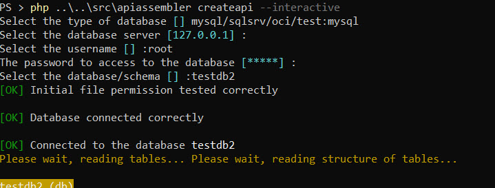

If the information is correct, then it will show an [OK] message. Otherwise, you can try it again.

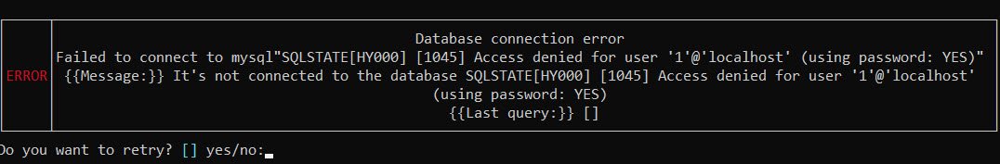

Once connected, it will show the next menu:

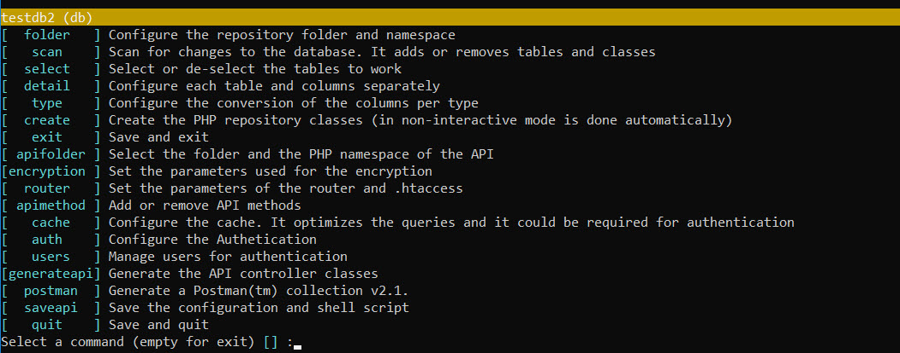

### 2) Scan (step required)

Scan will read the database for changes, and it will detect if there is a new tables/columns or if some 
tables/columns must be removed.


### 3) Folder (step required)

Now try the next option **folder** where you can set where the repository files will be generated. You also set the postfix of the new repository classes (usually it is called Repo)

You also must set the namespace of those clases. The namespace depends in your folder structure and composer's autocomplete configuration.

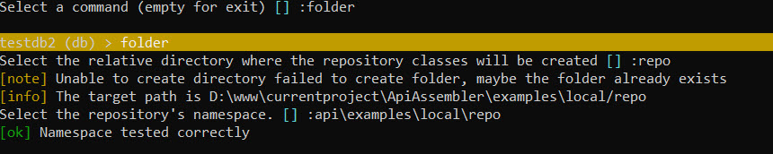

In this case, the root folder is located at d:\www\currentproject\ApiAssembler and composer.json contains the next line:

```json
"autoload-dev": {
  "psr-4": {
    "api\\": ""
  }
}
```

* if (folder) d:\www\currentproject\ApiAssembler = (namespace) api

* then (folder) d:\www\currentproject\ApiAssembler\examples\local\repo = (namespace) api\examples\local\repo

### 4) Apifolder (step required)

It is similar to folder but it is used to determine where the API controllers will be located and what will be the namespace.

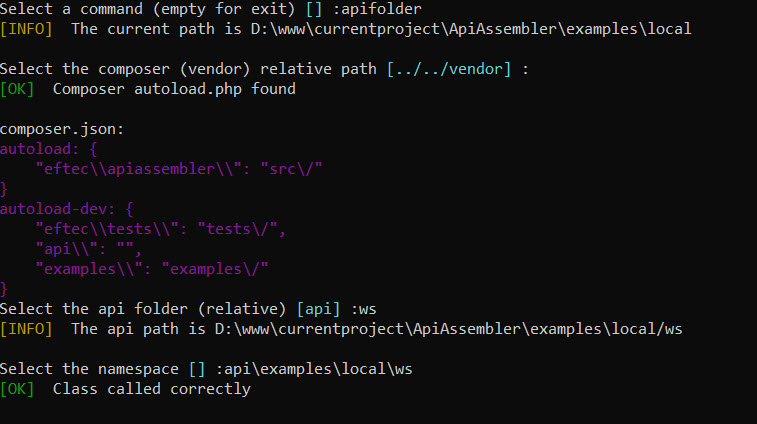

### 5) Router (Required)

In this menu, you can generate the router.php, router_auth.php and the .htaccess file.

* You need to re-generate the router class for every new configuration.
* You only need to generate the .htaccess file only once.
* Router_auth.php is only generated once, so you can edit the file without worry that it is override.  If you want to re-generate, then delete the file.

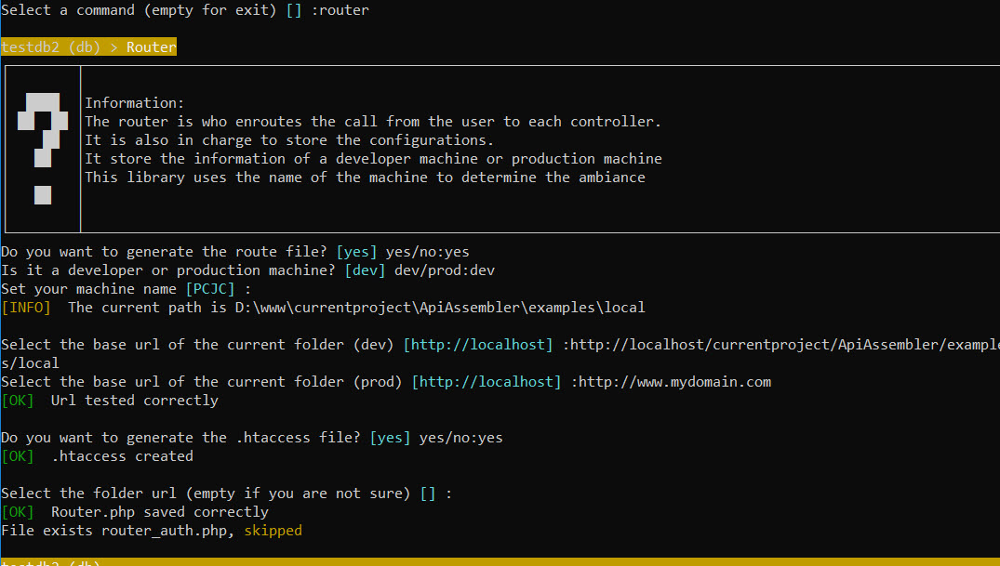


### 6) APIMethod (Required)

You can add or remove methods of the API Controller class.

You can add or remove a method for every class or for all classes at the same time.

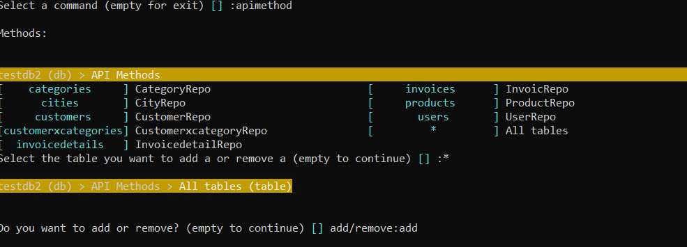

* The type of method determine what kind of method will be generated (example, insert,update, etc.)
* You can also set the duration of the cache. This function only works if cache is already configured. By default cache is not enabled.
* Dependencies indicates if you want to include in the values another column. For example, if the table as a MANYTOONE relation, then it could include the values of those relation. The dependencies are written as **"\\_ColumnName"**

### 7) Generateapi (Required)

And when you have all the information, then you can generate the repository and API controller files.

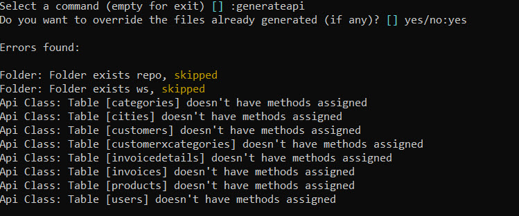

In the last example, we classes were generated but there is not method assigned. Otherwise, it will build the code.


## 8) Saveapi (Recommended)

Finally, you can save your configuration, so you can run it once.

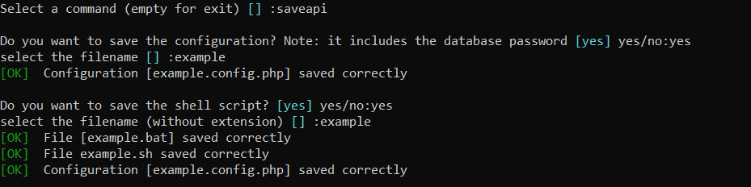

You can save your configuration and a script file to recall the process again.

In the last example, you can continue the configuration running one the next lines

```shell
./example.bat # windows
./example.sh  # linux/macos
php apisssembler createapi --loadconfig example --interactive # windows/linux/macos
```

**Why the configuration is saved as a PHP file?** (example.config.php)

It is for safety measures.  That file is not visible via Internet, even if it is keep in the web folder. It is because it contains a line that avoid the execution of the code.

### 9) Running the code

You can run the code by opening the url where you create your files.  If you are in the developer machine, then it will show the next screen. If you click on those options, then you can call your code if the function allows the method GET and it doesn't require any other value.

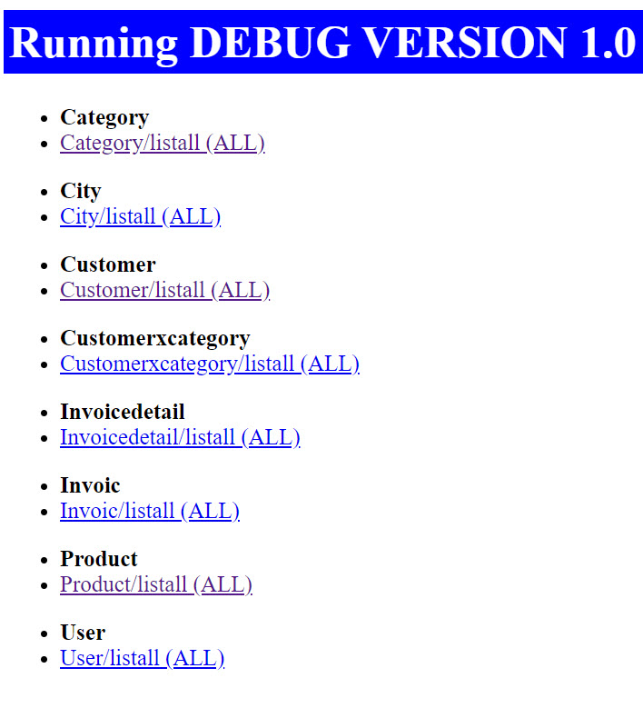

### 10) Rename using Detail (optional)

While the previous code could work but there are some naming problems. Invoices table is named "Invoic" instead of "Invoice". Also Invoicedetails table ls called "Invoicedetail" instead of "InvoiceDetail". 

So let's rename the column:

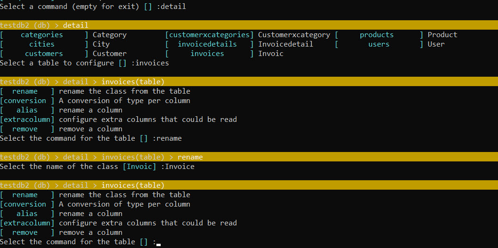

Then, you can re-build the router (menu "router") and generate the files again (menu "generateapi")

## Structure of the project

The project is quite minimalist, it consists of 3 folders

📁 root folder

​      📁 repository folder

​      📁 api controller folder

In the root folder there are 3 files

* .htaccess 
  * (used by Apache Web Server). This file could be generate with the option of the menu **"router"**
* router.php 
  * Our en-router (who redirects and coordinates to which controller to call and execute.
  *  It is also the main code that includes the configuration, creation of instances, etc.  This file could be generate with the option of the menu **"router"**
* router_auth.php
  * It is the authentication file.  It is generated only once with the option of the menu **"router"**
  * If you want to re-generate it, then delete it.
  * You can edit this file and add your own logic.


```shell
1) Select the value of databasetype [mysql] mysql/sqlsrv/oci:
2) Select the value of server [127.0.0.1] :
3) Select the value of user [root] :
4) Select the value of password [abc.123] :
5) Select the value of database [api-assembler] :

Database connected correctly

6) Select the base namespace [examples\localhost] :
7) Select the repository folder [repofolder] :repo
8) Select the api folder [apifolder] :api

Tables:

[*][1] productcategories
[*][2] products
[*][3] users
        [a] select all, [n] select none, [] end selection, [*] (is marked as selected)
9) Select or de-select a table to process [] :

Classes:

[1] Table:productcategories -> class:ProductCategory
        examples\localhost\repo\ProductCategoryRepo
        examples\localhost\api\ProductCategoryApiController
[2] Table:products -> class:Product
        examples\localhost\repo\ProductRepo
        examples\localhost\api\ProductApiController
[3] Table:users -> class:User
        examples\localhost\repo\UserRepo
        examples\localhost\api\UserApiController
10) Select the class to rename (empty to continue) [] 1-3:

Methods:

[1] examples\localhost\api\ProductCategoryApiController
         method name:custom type:empty verb:ALL
[2] examples\localhost\api\ProductApiController
         method name:custom type:empty verb:ALL
[3] examples\localhost\api\UserApiController
         method name:insert type:insert verb:ALL
[4] All Classes
11) Select the class you want to add a new method (empty to continue) [] 1-4:
12) Do you want to generate the route file? [yes] yes/no:
13) Is it a developer or production machine? [dev] dev/prod:
14) Set your machine name [PCJC] :
15) Select the base url (dev) [http://localhost] :
16) Select the base url (prod) [http://localhost] :
17) Select the folder url [api] :
18) Do you want to use cache? [no] yes/no:yes
   1) Is it a developer or production machine? [redis] redis/apcu/memcached:
   2) Cache server [127.0.0.1] :
   3) Cache port [6379] :
   4) Cache schema [] :
   5) Cache user [] :
   6) Cache password [] :
19) Do you want to override the files with the classes? [no] yes/no:yes

Errors found:

Folder:
Folder:
router.php saved correctly

20) do you want to save the configuration? Note: it includes the database password [yes] yes/no:yes
select the filename [file2.json] :
File saved correctly
Done.
```

1. Selects the type of the database, mysql, sqlsrv (mssql server) or oci (Oracle)
2. It selects the server machine. It depends on the type of database
   1. mysql: the IP of the server
   2. sqlsrv: the IP / instance or name machine / instance
   3. oci: It could be the tsname or the ez-config
3. The user name of the database. In OCI, it is also the schema.
4. The password of the database.
5. The database to connect.
6. The base namespace, example: "\namespace1\namespace2"
7. The folder (relative to the current path) of where the repository classes will be generated.
   1. If the folder does not exist, then it will be created.
8. The folder (relative to the current path) of where the apiclasses will be generated.
   1. If the folder does not exist, then it will be created.
9. You can select the table to process or remove.  All tables marked with "*" are selected
10. You can decide to rename a class.
    1. By default, the name of the classes are generated using the name of the tables in singular.
11. You can add a method to a class
    1. Inside this method, you can add one new method for a class. A method consists of the type of method, name and HTTP verb.  Check the list of methods for more information.
12. Yes if you want to generate the route file (route.php). If the file exists and we select to "no to override", then the file is not generated and: you can delete it manually or force to override it.
13. You can select if the current machine is the developer or production machine. Router.php by default contains two ambiances, developer and product. The code determines automatically the current ambiance using the name of the machine.
14. You can set the name of the machine or left it automatically.
15. You can set the base web URL (developer). The base web is the web that it must show it in the current folder.
    1. For example, lets say you are working in the new folder **/var/www/domain.dom/example/folder** or in the folder **c:\www\example\folder**, then if the root url folder (http://localhost) points to **/var/www/domain.dom** or **c:\www**, then your base web URL must be http://localhost/example/folder (without the trailing "/")
16. You can set the base web URL (production). The base web is the web that it must show it in the current folder.
17. You can set the API folder.
    1. The end url is composed by **BASE WEB URL / API FOLDER / CONTROLLER / ACTION / ID  / IDPARENT **
    2. Example: "http://localhost/api/Product/list/20" (in this example, idparent is not set)
18. You can select if you want to use or not cache
    1. You can select the type of cache (redis, apcu or memcached)
    2. You can select the IP of the cache server (usually 127.0.0.1)
    3. You can select the port of the cache server
    4. You can select the schema (or folder) of the cache
    5. You can select the user of the cache server, if any (by default, redis, apcu and memcached does not use user or password)
    6. You can select the password of the cache server, if any
19. If you mark yes, the every file is override. Otherwise, the code only generates files that don't exist.
20. Finally, you can save all the user input values in a file.
    1. Later, you can recover the configuration as **php ApiAssembler.php -create -file file.json**

## List of methods

It is the list of template of methods allowed to the creation of a new method.

| methods    | action                                                                                                                           | default input values                                                                                                                             | default output                                       |
|------------|----------------------------------------------------------------------------------------------------------------------------------|--------------------------------------------------------------------------------------------------------------------------------------------------|------------------------------------------------------|
| insert     | insert a new record.                                                                                                             | Values are received by the body (json)                                                                                                           | return the last identity (if any) or the primary key |
| update     | update a new record. Values  are passed by the POST body (json)                                                                  | Values are received by the body (json)                                                                                                           |                                                      |
| delete     | delete a new record by using  the id. V                                                                                          | Values are received by the body (json)                                                                                                           |                                                      |
| get        | get a single row using the  primary key                                                                                          | domain/controller/action/**PRIMARYKEY**                                                                                                          | Returns a json with the row or null if none          |
| count      | count the number of records  (all rows)                                                                                          |                                                                                                                                                  | Returns a json with the number of rows               |
| listall    | list all the records. You  should not use it in a huge table, use instead listpaged.                                             |                                                                                                                                                  | Returns a json with the rows or null if none         |
| listpaged  | list the record paged, order  and sorted.                                                                                        | The URL must be in the form of  domain/controller/action?page=**numpage**&order=**column**&orderdir=**desc**,  where numpage must starts with 1. | Returns a json with the rows or null if none         |
| listfilter | list the records that matches  a condition                                                                                       |                                                                                                                                                  | Returns a json with the rows or null if none         |
| listraw    | runs a raw (sql native query)  query                                                                                             |                                                                                                                                                  | Returns a json with the result or null if none       |
| alias      | creates an alias of a method  (a method that calls other method).<br />For example, an empty alias that calls the method listall | domain/controller/ -> domain/controller/listall                                                                                                  | It calls other methods                               |
| empty      | empty method, you can edit it  on your own.                                                                                      |                                                                                                                                                  |                                                      |

Verbs:

| verb   | description                                                                             |
|--------|-----------------------------------------------------------------------------------------|
| GET    | HTTP GET. You can't get the body.                                                       |
| POST   | HTTP POST                                                                               |
| PUT    | HTTP PUT                                                                                |
| DELETE | HTTP GET                                                                                |
| ALL    | All verbs. In case of conflict with other methods, this method have the lower priority. |

## Database Methods

This library uses EFTEC/PDOOne to do the connection to the database.

```php
$identity=RepoClass::insert($obj); // (DML) insert a record 
$result=RepoClass::update($obj); // (DML) update a record
$result=RepoClass::deleteById($primarykey); // (DML) delete a record by the primary key
$result=RepoClass::deleteById($obj); // (DML) delete a record by the object.
$result=RepoClass::toList(); // list all values
$result=RepoClass::first(); // returns only the first row (if any)
$result=RepoClass::where('condition',[param])->toList(); // a "where" condition.
$result=RepoClass::order('column')->toList(); // sort the values by a column
$result=RepoClass::count(); // returns the number of rows.
$result=RepoClass::where('condition',[param])->count(); // returns the number of rows with conditions
$result=RepoClass::setRecursive('_column')->toList(); // if Repo Class contains a relational column (Many to One, One To Many, etc.), then this field is returned. By default all columns that could be recursive starts with "_".
$result=RepoClass::query('select * from table where id=?',[param]); // execute a raw query with or without parameters.

```

There are many other methods (including DDL methods) but they are the basic ones.

## Cache

It also allows to cache the results as follows:

```php
$result=RepoClass::useCache(5000)->toList(); 
// the result is cached for 5000 seconds. Passed 5000 seconds, the cache is destroyed.
// the cache is also destroyed if we run any DML command, such as insert,update or delete using the same Repo Class
// the cache could also be invalidated manually:
$result=RepoClass::invalidateCache('cachespecial');
// However, the cache is not destroyed if we run a DML command via query, of if we update a value using another repository class.

// You can set the group/family of cache as follows:
$result=RepoClass::useCache(5000,'cachespecial')->toList(); 
//and you can invalidate with
$result=RepoClass::invalidateCache('cachespecial');
```

## Reading information

If you want to read user input, then, you can still use $_GET and $_POST values but you also could read values from the Router

Reading the body:

```php
$values=$this->api->routeOne->getBody(true); // it reads the body and de-serialize the json as an associative array.
```

Reading a header

```php
$value=$this->api->routeOne->getHeader('key','default value if not found');
```

Reading a URL parameter

```php
$value=$this->api->routeOne->getParam('key','default value if not found');
```

Reading a post parameter

```php
$value=$this->api->routeOne->getPost('key','default value if not found');
```

Reading the post if not the URL parameter

```php
$value=$this->api->routeOne->getRequest('key','default value if not found');
```


## Changelog

* 1.2 2023-03-04
  * Updates to the code.
* 1.0 2022-09-01
  * First release version

* 0.2 2022-03-06
  - [ ] generate script
  - [ ] generate apicontroller
  - [ ] save script correctly
  - [ ] interactiva
  - [ ] non interactive
  - [ ] save file

* 0.1 first version


# Licence

Copyright: Jorge Castro Castillo - Eftec Chile (2022-203)

Dual License, GPL-v3 and Commercial.  See license file for more information

In short (not legal advice):

 "You may copy, distribute and modify the software as long as you track changes/dates in source files. Any modifications to or software including (via compiler) GPL-licensed code must also be made available under the GPL along with build & install instructions. If you don't want to use GPL license, then you can opt for a commercial license."
